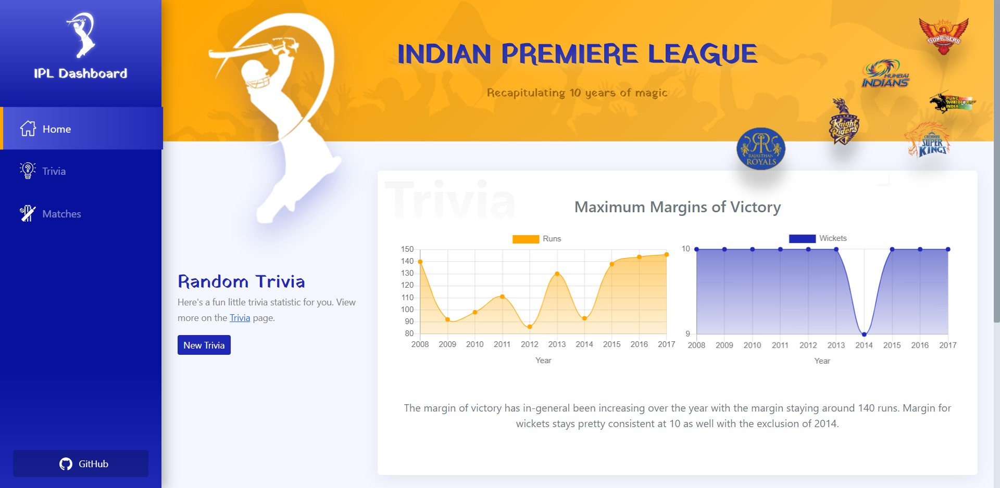

# IPL Dashboard

## Example

## Description

IPL match details across all seasons.
The result column can be normal, draw, no-result or tie. If it was a tie, there would also be a super over. normal means that it was a regular match where the team that scored more and won the match.

## Key features

* **Home** view showing random trivia statistic and a match which was played on the same *date* as today.

* **Trivia** view with all the trivia stats listed for easy reference.

* **Matches** view contains a library for each and every match played between 2008 and 2017. It also allows multiple filtering and sorting of matches.

* Query-based route URLs (using match `id`) for each match for easy sharing.

* Fully dynamic chart creation using a custom-made component.

* Setup a seamless SCSS styling workflow for theming, making it as simple as updating one variable to change the look of the entire app.

* Completely responsive.

>### How about some trivia about the computation of trivia?
> All the trivia stats are being computed in a [separate file](src/components/Trivia/trivia.js) using just a single loop! They are stored as an array of objects with each object representing an input for the `Chart` component.
>
> This gives a good abstraction for the trivia computation with only 1 exported method.

## Libraries used

* Vue.js
* Vue Router
* Chart.js

## Dataset

Indian Premier League (Match Analysis) by *Saurav Anand* (https://www.kaggle.com/saurav9786/indian-premier-league-match-analysis)

## Bonus Points

✅ Built on Vue.js (with ❤)

✅ Optimized loading time 
*Bonus points if
*you create the web-app in vue.js.
*you can optimize the loading time.
*you make it mobile responsive.
*you make it a progressive web-app.
*you make it offline usable.

